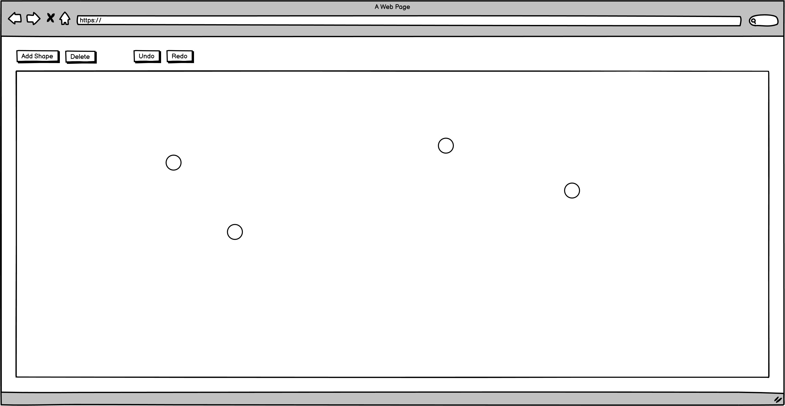

# react-interview-q2

## Instructions

Clone this repo first into your own github account. Make sure to thoroughly read the instructions and implement the react component to meet the provided requirements. Send back a link to your cloned repo. You are expected to make implementation choices around customer experience and efficiency. Please make sure to explain your choices in comments.

## Requirements

Please build the following form component

* Add shape inserts a circular shape onto the drawing area at a random coordinate on screen
* Click on a shape to select it, Pressing Delete will remove the selected shape
* Undo/Redo can be used to undo or redo any user action
* **bonus** user can drag and drop the shap